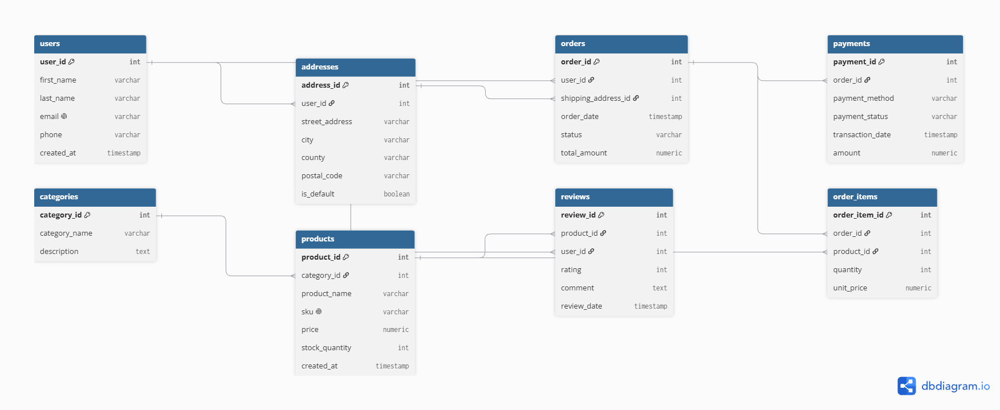

# E-Commerce Relational Database Design & Complex Analytics

## Overview
This project presents a fully normalized relational database schema designed for a modern B2C E-Commerce platform. The system manages core retail operations including user profiles, multi-address management, product categorization, order processing, line-item tracking, payments, and product reviews.

Additionally, it includes an advanced Business Intelligence (BI) suite featuring analytical queries designed to derive actionable business metrics (Customer Lifetime Value, Product Category Revenue Shares, Repeat Purchasing Patterns, and Inventory Management Matrix).

---

## Entity-Relationship Diagram (ERD)


---

## Database Architecture & Schema Details

The schema consists of 8 interconnected tables designed to ensure data integrity and query efficiency:

* `users` — Stores customer profile data.
* `addresses` — Handles multiple shipping addresses per user (**1:N** relationship).
* `categories` — Classifies products into distinct hierarchical groups.
* `products` — Stores inventory details, pricing, and stock levels (**1:N** with categories).
* `orders` — Tracks order metadata, current status, and total values (**1:N** with users).
* `order_items` — Junction table resolving the **M:N** relationship between orders and products.
* `payments` — Enforces transaction tracking with a strict **1:1** relationship to orders.
* `reviews` — Contains product reviews and ratings (**M:N** junction between users and products with a unique constraint preventing duplicate reviews).

---

## Normalization Process (1NF to 3NF)

To eliminate redundancy and prevent insertion, update, and deletion anomalies, the architecture adheres strictly to **Third Normal Form (3NF)**:

### First Normal Form (1NF)
* **Atomic Values:** Every column contains indivisible values (e.g., `first_name` and `last_name` are split, addresses are separated into `street_address`, `city`, `county`, and `postal_code`).
* **Primary Keys:** Every table defines a unique primary key (`SERIAL / AUTO_INCREMENT`).
* **No Repeating Groups:** Order details are separated into individual line items (`order_items`) rather than comma-separated lists in the `orders` table.

### Second Normal Form (2NF)
* Meets all **1NF** requirements.
* **Full Functional Dependency:** In junction tables like `order_items`, attributes such as `unit_price` and `quantity` depend entirely on the surrogate composite identifier/key, avoiding partial dependencies on just `order_id` or `product_id`.

### Third Normal Form (3NF)
* Meets all **2NF** requirements.
* **No Transitive Dependencies:** Non-key attributes depend *only* on the primary key.
  * *Example:* Customer addresses were extracted into `addresses` rather than embedding city/county inside `orders`.
  * *Example:* Category descriptions reside in `categories`, preventing product records from duplicating category metadata.

---

## Key Constraints & Data Integrity

* **Primary & Foreign Keys:** Explicit referential integrity enforced across all relationships with cascading deletes where appropriate (e.g., deleting an order removes its `order_items`).
* **Check Constraints:** 
  * `price >= 0` and `stock_quantity >= 0` on `products`.
  * `quantity > 0` on `order_items`.
  * Restricted enum-like values for status fields (`orders.status`, `payments.payment_status`, `payments.payment_method`).
  * `rating BETWEEN 1 AND 5` on `reviews`.
* **Uniqueness Constraints:** `users.email`, `products.sku`, `categories.category_name`, and composite unique constraints (`user_id`, `product_id`) on `reviews`.

---

## Analytical & Business Intelligence Capabilities

The repository includes `queries_and_analytics.sql` which demonstrates intermediate and advanced SQL techniques to solve real-world e-commerce business questions:

1. **Customer Lifetime Value (CLV) & Loyalty Tiers:** Aggregates order history per user and classifies customers into dynamic spending tiers using `CASE` statements and `LEFT JOIN`s.
2. **Category Revenue Shares:** Utilizes Common Table Expressions (CTEs) and Window Functions (`DENSE_RANK()`, `SUM() OVER()`) to measure product performance within each category.
3. **Financial Audit & Order Reconciliation:** Compares recorded header totals against calculated line-item sums to detect system accounting discrepancies.
4. **Order Frequency & Churn Risk:** Leverages the `LAG()` window function to calculate days elapsed between consecutive customer purchases.
5. **Inventory & Rating Action Matrix:** Cross-analyzes product rating averages with stock levels to issue automated stock alert signals.

---

## Setup & Execution

### Option 1: Via Command Line (`psql`)

1. Clone the repository:
   ```bash
   git clone [https://github.com/chivasebastian/ecommerce-relational-db-design.git](https://github.com/chivasebastian/ecommerce-relational-db-design.git)
   cd ecommerce-relational-db-design

2. Create a new PostgreSQL database:
   ```bash
createdb -U <your_username> ecommerce_db

3.Run the schema creation script:
    ```bash
psql -U <your_username> -d ecommerce_db -f schema.sql 

4. Populate mock data:
    ```bash
psql -U <your_username> -d ecommerce_db -f data_insertion.sql

5. Run the analytics suite:
    ```bash
psql -U <your_username> -d ecommerce_db -f queries_and_analytics.sql


Option 2: Via GUI (pgAdmin / DBeaver)
Create a new database in your SQL client (e.g., ecommerce_db).

1. Open a Query Window inside that database.

2. Execute schema.sql to build tables and constraints.

3. Execute data_insertion.sql to populate initial test data.

4. Execute queries_and_analytics.sql to view business reports and advanced analytics.

Option 3: From inside the psql interactive terminal
If you are already connected to your PostgreSQL server via psql:

1. Connect to your target database:

SQL
\c ecommerce_db
2. Execute the scripts in order:

SQL
\i schema.sql
\i data_insertion.sql
\i queries_and_analytics.sql
